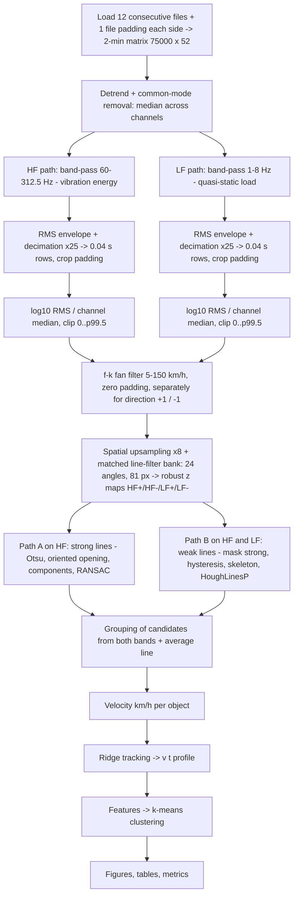

# Algorithm flowchart (source for report/figures/flowchart.png)

```mermaid
flowchart TD
    A[Load 12 consecutive files + 1 file padding each side -> 2-min matrix 75000 x 52] --> B[Detrend + common-mode removal: median across channels]
    B --> HF1[HF path: band-pass 60-312.5 Hz - vibration energy]
    B --> LF1[LF path: band-pass 1-8 Hz - quasi-static load]
    HF1 --> HF2[RMS envelope + decimation x25 -> 0.04 s rows, crop padding]
    LF1 --> LF2[RMS envelope + decimation x25 -> 0.04 s rows, crop padding]
    HF2 --> HF3[log10 RMS / channel median, clip 0..p99.5]
    LF2 --> LF3[log10 RMS / channel median, clip 0..p99.5]
    HF3 --> F[f-k fan filter 5-150 km/h, zero padding, separately for direction +1 / -1]
    LF3 --> F
    F --> H[Spatial upsampling x8 + matched line-filter bank: 24 angles, 81 px -> robust z maps HF+/HF-/LF+/LF-]
    H --> S[Path A on HF: strong lines - Otsu, oriented opening, components, RANSAC]
    H --> W[Path B on HF and LF: weak lines - mask strong, hysteresis, skeleton, HoughLinesP]
    S --> M[Grouping of candidates from both bands + average line]
    W --> M
    M --> V[Velocity km/h per object]
    V --> T[Ridge tracking -> v t profile]
    T --> K[Features -> k-means clustering]
    K --> R[Figures, tables, metrics]
```
